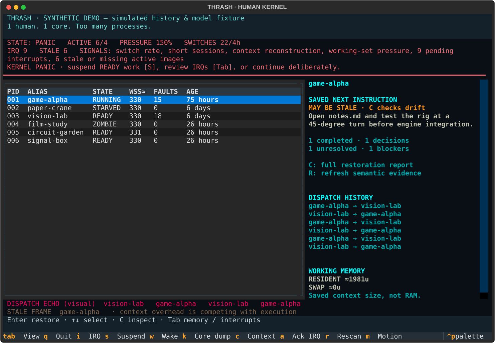

# THRASH

**She didn’t need another planner. She needed a kernel.**

`1 human. 1 core. Too many processes.`

## The human bug

My friend has too many tabs open. Not browser tabs. Mental ones.

A game, a paper, a prototype, a half-written explanation. The hard part is returning: what worked, why that decision was made, where the experiment stopped, and what to do next. A task list can remember “work on the game.” It rarely remembers enough to make that instruction useful.

## I had seen this failure before

An operating system thrashes when moving working sets around consumes the resources needed to execute them. THRASH borrows that model for project work: save context before switching, restore it on return, and make repeated reconstruction visible.

It cannot restore a person's mind exactly. It reconstructs a useful, fallible account from files and commits. Missing evidence stays missing.

## The human kernel

THRASH is a local CLI and full-screen terminal interface. Projects are processes; saved repository context is their process image. Local Gemma extracts the semantics. Python keeps the states, timestamps, event counts, file boundaries and heuristic rules.

The screen can become unstable because the recorded scheduler is unstable. The controls and metrics stay readable. Suspending work pages its saved context to swap; recovery removes the visual pressure.

## Demo

```bash
thrash demo             # isolated TUI; N advances nine scenes, Q exits
thrash demo --script    # print the same nine scenes; no model required
```

This mode uses **synthetic repositories, hand-authored images and simulated time** in a temporary directory. Its banner says so. It never loads your registry or scans your projects, and cleans up on exit. The scenario moves from a clean kernel through PAGE FAULT, IRQ, thrashing, starvation, zombie residue, OUT OF MIND and PANIC to recovery.

For actual local-model extraction on synthetic Git repositories, use `demo/run_demo.sh` with Ollama running. See [the nine-scene demo script](docs/demo-script.md), [verification](docs/prompt2-verification.md), and [the original network-isolated run](docs/foundation-verification.md). Simulated ages are always labeled.



[Real local Gemma resume report](docs/examples/resume-gemma.txt) · [PAGE FAULT capture](docs/examples/resume-fixture.svg) · [Recovery memory map](docs/examples/kernel-memory.svg)

## Page faults: the point of the product

Switching back should answer eight questions:

- What did I do, and what finished?
- What did I decide, and why?
- Where did I stop, and which files matter?
- What changed while I was away?
- What remains unresolved or blocked?
- What is the single next instruction?

`switch`, `wake`, `status`, and the TUI use **one canonical resume report**. Decisions and completed work carry source paths; unsupported claims are labeled inferred. A decision without a recorded reason says “Reason not recorded.” Older images still load, with missing fields shown explicitly. `thrash status game-alpha --refresh` rebuilds the semantic image with local Gemma.

A shortened synthetic fixture report:

```text
PAGE FAULT · game-alpha
Process image is 71 hours old.  [simulated age]

WHAT YOU FINISHED
  Camera follow prototype runs
  evidence: notes.md

WHAT YOU DECIDED AND WHY
  Validate rig before engine integration
  why: Avoid rebuilding an untested rig
  evidence: notes.md

WHERE YOU LEFT OFF
  Stopped before testing the 45-degree turn pose

WHAT CHANGED SINCE THEN
  notes.md changed; review the updated integration note

WHAT REMAINS UNRESOLVED
  Does the shoulder deform during a turn?

NEXT INSTRUCTION
  Open notes.md and test the rig at a 45-degree turn before engine integration.
```

The report contains saved knowledge plus deterministic drift evidence. It does not quietly rewrite the next instruction when the repository changes. Review the drift or explicitly refresh.

## Terminal controls

Run `thrash` in a terminal for the full-screen kernel. In a pipe, no arguments print help instead of opening a UI.

| Key | Action |
|---|---|
| ↑ / ↓, Enter | Select a process; save current context and restore the selection |
| C / R | Inspect saved context and drift / rebuild with local Gemma |
| I | Capture an IRQ without switching |
| S / W | Suspend to swap / wake to READY |
| K | Confirm termination with a meaningful core dump |
| Tab | Cycle process table, memory map, interrupt queue |
| A | In the IRQ view, acknowledge the oldest pending interrupt |
| M | Toggle reduced motion |
| Esc / Q | Close a report / quit the kernel |
| N | Advance a scene, in `thrash demo` only |

Repository and model work runs outside the UI thread. Kernel operations are serialized within the TUI. Quit waits for an in-flight operation to finish; IRQ text entered during one is held visibly until it can be persisted. Use `THRASH_REDUCED_MOTION=1` for stable pressure indicators. Narrow terminals give the process table the full width; C opens the details.

## Interrupts

```bash
thrash irq "Try a smaller prototype"
thrash irq "Revisit the camera test" --route
thrash interrupts
thrash interrupts --ack 1
```

An IRQ saves redacted text, timestamp and the current alias. It does not end the current session, change the process state, or create another project. Optional local Gemma routing suggests current project, existing project, new project, note, or unclear. Invalid destinations and unavailable inference fall back to unclear; the capture survives. Suggestions never execute.

## Starvation

A READY process becomes *starved* when it has waited at least 48 hours, other projects received at least six dispatches during that wait, and it received under ten minutes of recorded execution. Sleeping deliberately is not starvation. An old folder alone is insufficient. The UI shows the wait and competing dispatches as evidence; STARVED is a diagnostic label, not a stored lifecycle state.

Tune `THRASH_STARVATION_HOURS`, `THRASH_STARVATION_SWITCHES`, and `THRASH_STARVATION_EXECUTION_MIN`. Legacy registries use registration time until a new READY transition records a precise waiting start.

## Zombies

Idle time plus unfinished residue derives ZOMBIE. The explanation shows repository inactivity and saved unresolved/blocker/TODO references. It does not infer emotional attachment or claim that other projects mention it. Deliberately sleeping work can still show a zombie warning if the existing idle-plus-residue rule applies; its stored state remains SLEEPING.

## OUT OF MIND

At six active processes by default, registering another requires a choice:

```bash
thrash fork vision-lab --path ./synthetic-project --suspend game-alpha
thrash fork vision-lab --interrupt
thrash fork vision-lab --path ./synthetic-project --force
```

The report gives active count, pressure, recent switches, IRQ backlog, and oldest READY suspension candidates. `init` accepts the same admission flags. Nothing is killed automatically. Non-interactive extreme-pressure admission exits without changes unless a choice is supplied. Below this threshold the original fork pressure warning still warns and proceeds. Configure `THRASH_OOM_ACTIVE`.

## Core dumps

`thrash kill game-alpha --core` saves the last image, purpose, completed work, unresolved work, attempted failures, decisions and reasons, last intention and any recorded condition for returning. Unknown facts stay unknown. The repository remains untouched.

`thrash resurrect game-alpha` restores that image, checks drift, and returns the process to READY. A core dump is a recoverable execution state, not a deleted-folder metaphor.

## Visual thrashing and kernel panic

The monitor maps the existing four-signal heuristic to NORMAL, PRESSURE and THRASHING. PANIC requires **all** of: six active processes, twenty switches in the current window, eight pending IRQs, and three stale or missing active images. Defaults are adjustable with `THRASH_PANIC_ACTIVE`, `THRASH_PANIC_SWITCHES`, `THRASH_PANIC_IRQS`, and `THRASH_PANIC_STALE`.

PANIC is a recovery advisory, never an application crash: suspend READY work, review IRQs, or keep working deliberately. Recent switch history can keep THRASHING visible after suspension until the window expires; recovery does not erase telemetry.

Pressure increases the warning borders and redraw traces. Thrashing adds echoes of actual dispatches; panic increases their displacement. A separate visual band labels these echoes so they cannot be mistaken for extra process rows or new events. The memory map shows estimated saved context units, and a short paging trace follows a successful suspend. Reduced motion removes displacement. Visual layers settle over three ticks after the underlying mode recovers.

## Processes

| State | Meaning | How it is decided |
|---|---|---|
| `RUNNING` | what you are working on | stored; the registry enforces **at most one** |
| `READY` | active, waiting for attention | stored |
| `SLEEPING` | deliberately suspended, context serialized | stored (`thrash suspend`) |
| `ZOMBIE` | idle but still haunted | **derived**, never stored: no repo activity for `THRASH_ZOMBIE_DAYS` (14) **and** residue (unresolved items, blockers, or TODO/FIXME/open-checkbox lines) |
| `TERMINATED` | closed on purpose | stored; optional core dump |

Killing a process only changes THRASH's state. Your repository is never touched.

## Context switching

`thrash switch <project>` does, in order:

1. inspect the leaving project's repository (commits, dirty files, notes, TODOs),
2. build or update its process image (reused when the inspected fingerprint—HEAD, dirty paths and allowed-file modification times—matches the last image),
3. page it out to `swap/<alias>.ctx`,
4. record the switch and move it to `READY`,
5. restore the destination image (**PAGE FAULT**),
6. compare it with the repository now and report **drift**,
7. mark the destination `RUNNING`.

If the destination has never been scanned, the page fault reconstructs its context from the repository, and that counts as a *reconstruction* in the thrashing heuristic.

Drift is deterministic. It lists commits and files changed since the snapshot, and flags a saved *open* assumption ("undecided", "unresolved", "not started"...) as `ASSUMPTION MAY BE STALE` only when new commit subjects or changed paths share vocabulary with it, always with the evidence attached. It never claims a contradiction.

## What Gemma actually does

Gemma, through Ollama, turns repository text into a structured process image: summary, completed work, decisions and reasons, program counter, registers, stack, unresolved questions, blockers, next action, last useful state and evidence. It can also suggest an IRQ destination when explicitly requested.

- The reply is constrained with a JSON schema, then validated by Pydantic. Malformed output gets **one** repair attempt, then is rejected; nothing invalid is ever stored, and the previous image survives.
- Paths the model cites that do not exist (or are ignored) are dropped and counted. A decision without a real source is marked *inferred*.
- The prompt says: don't invent facts, prefer evidence, separate explicit decisions from inference, state uncertainty, cite files from the file list only.

Gemma is **not** responsible for timestamps, switch counts, pressure, file discovery, or Git diffs. All of that is plain deterministic code.

## Why local/open-weight AI

THRASH reads the contents of unreleased, private projects. That context should not leave the machine. It runs on a local Gemma through Ollama: no API keys, no cloud inference, no outbound analytics. Its scheduler event log stays local. In a test run, every `connect()` made during a real switch targeted `127.0.0.1:11434` / `::1:11434` and nothing else. If Ollama is down, deterministic commands (`top`, `ps`, `status`, state changes) keep working and extraction reports `LOCAL MODEL UNAVAILABLE`.

The synthetic demo also passed with both THRASH and a temporary Ollama server inside a network namespace with only loopback available. This verifies operation without an external network interface, with model weights already installed. See [verification notes](docs/foundation-verification.md).

## Privacy

- **Aliases.** Choose a public-safe alias at `init`. Terminal output masks absolute local paths and substitutes registered directory names with their aliases. Storage messages use `swap/<alias>.ctx` and `graveyard/<alias>.core`. Real repository paths remain in the private registry and core dumps so resurrection can find the repository.
- **`.thrashignore`** (project root, plus `$THRASH_HOME/thrashignore` globally): ignored paths are never listed, read, fingerprinted or sent to the model. Defaults: `.env`, `*.pem`, `*.key`, `credentials*`, `secrets*`, `node_modules/`, `.venv/`, `dist/`, `build/`, `.git/`, ... Syntax is a gitignore subset (no `!` negation).
- **Filesystem boundaries.** All symlinks are skipped, including linked ignore files. `.gitignore` applies even to tracked files; nested ignore rules apply to plain directories too. Sensitive configuration, credentials, tokens, certificates and key files are excluded by default. POSIX file reads open each path component without following links; platforms without that primitive skip file reads.
- **Excluded roots.** `THRASH_EXCLUDE_ROOTS` is an OS-path-separator-delimited list of absolute directory roots. Exclusions are checked before filesystem inspection or discovery descent. Registration rejects excluded or linked roots.
- **Redaction.** Secret-looking assignments (`api_key = ...`, `password: ...`, known token shapes, private-key blocks) are masked in document bodies, TODO samples, commit subjects, assembled prompts and terminal text. Pattern matching is not a guarantee that every possible secret can be recognized; use ignore rules for sensitive material.
- **Local transport.** Ollama endpoints must be literal loopback addresses or `localhost`; environment proxies and cloud model names are rejected/disabled. The Ollama server itself must also be configured to use local models.
- **No surveillance.** No keystrokes, no browser history, no global process scanning. THRASH logs only what THRASH itself does (`events.jsonl`).

Limit: prose may contain private identities other than the registered directory name. Aliases cannot identify arbitrary personal/company names automatically. Real-project verification stays private; public examples and screenshots use only synthetic repositories.

## How thrashing is detected

A scheduler heuristic, **not** neuroscience. Four transparent signals over a sliding window (default 4 hours):

| Signal | Fires when | Env var |
|---|---|---|
| switch rate | switches in window ≥ 6 | `THRASH_SWITCH_LIMIT` |
| short sessions | median session < 20 min (needs ≥ 3 sessions) | `THRASH_MEDIAN_SESSION_MIN` |
| context reconstruction | switches that needed reconstruction ≥ 3 | `THRASH_RECON_LIMIT` |
| working-set pressure | active (RUNNING+READY) ≥ 4 | `THRASH_MAX_ACTIVE` |

`THRASHING` when at least `THRASH_SIGNALS_REQUIRED` (2) fire, `STRAINED` for one, otherwise `NOMINAL`. The new monitor labels the latter two PRESSURE and NORMAL; the original API/text table labels remain compatible. Window: `THRASH_WINDOW_HOURS`. PANIC adds the conjunctive gate described above.

A switch needed *reconstruction* if the destination had no image, its image is older than `THRASH_STALE_HOURS` (24), or drift was MODERATE/HIGH.

Metrics shown by `thrash top`: **LOAD** is the share of recorded run-time in the last 24 h (from your sessions). **CTX~** is an *estimate*: serialized image characters ÷ 4, rounded down (minimum 1), roughly token-like units. TUI **WSS≈** uses the same estimate; it is not bytes of RAM or a measurement of mental capacity. TUI FAULTS counts recorded switches that required reconstruction, not every opening of a report. **Pressure** is active ÷ limit, a definition, not a measurement of anything in your head.

## Installation

Requires Python 3.11+, Git, and [Ollama](https://ollama.com) with a Gemma model.

```bash
ollama pull gemma3:4b
git clone https://github.com/miclaldogan/thrash && cd thrash
python -m venv .venv && . .venv/bin/activate
pip install -e .            # or: pipx install .
thrash --help
```

Configuration is plain environment variables (see [`.env.example`](.env.example)). `THRASH_MODEL` picks the model (default `gemma3:4b`); `THRASH_OLLAMA_URL` the server; `THRASH_HOME` the data directory (default `~/.local/share/thrash`, XDG-aware).

## Commands

| Command | What it does |
|---|---|
| `thrash` | full-screen kernel in a terminal; help in a pipe |
| `thrash demo [--script]` | isolated nine-scene synthetic scenario |
| `thrash irq TEXT [--route]` | persist a redacted interrupt; optionally suggest a local route |
| `thrash interrupts [--ack ID]` | inspect or acknowledge queued interrupts |
| `thrash init [--alias A]` | register the current project, build its first process image |
| `thrash top [-w]` | kernel monitor: process table, pressure, thrashing state |
| `thrash ps [-a]` | plain process list for scripts and screenshots |
| `thrash status [P] [--refresh]` | canonical resume report; optional semantic rescan |
| `thrash switch P` | save the running process, restore P, report drift |
| `thrash suspend P` | snapshot P and put it to SLEEPING |
| `thrash wake P` | SLEEPING → READY and restore context (does not switch) |
| `thrash fork NAME` | register a new process; warns under pressure (`--suspend X`, `--force`, `--create`) |
| `thrash kill P` | extract final state, optionally write a core dump (`--core/--no-core`, `-y`) |
| `thrash resurrect CORE` | re-register a terminated process from its core dump |

At extreme pressure, `fork` and new registrations require an explicit admission choice; ordinary pressure retains the original warning behavior.

## Architecture

```text
cli.py / tui.py ──► scheduler.py (Kernel) ──► registry.py      process table, one-RUNNING invariant
 │             │    │                 telemetry.py     events.jsonl
 ▼             │    └► drift.py       saved image vs repo now
ui.py          ▼
        git_context.py ──► privacy.py   evidence gathering; ignore rules + redaction
               │
               ▼
        extract.py ──► prompts.py, ollama_client.py ──► local Ollama / Gemma
               │
               ▼
        process_image.py   schemas + strict validation
```

`resume.py` supplies the shared restoration object; `diagnostics.py` derives starvation/admission/PANIC; `interrupts.py` stores and optionally routes IRQs; `visuals.py` maps actual modes to display effects. The TUI does not own state.

Storage (`~/.local/share/thrash/`): `registry.json`, `events.jsonl`, `interrupts.json`, `processes/NNN.json` (live image + fingerprint), `swap/<alias>.ctx` (paged-out copy), `graveyard/<alias>.core`. Registry, image, swap, IRQ queue and core files use atomic replacement. Events are appended to JSONL; malformed/torn lines are skipped when reading. Restoration selects the newest valid resident/swap copy, preferring the resident on timestamp ties.

Events carry: timestamp, from/to project, time since last switch, snapshot age, restore duration, session length, whether reconstruction was needed, drift level, and the destination's last commit time.

## Limitations

- It is only as good as your repositories. Work that lives in no file, commit or note is invisible to it. THRASH never sees what is in your head.
- Small local models misread things. Confidence is the model's own, and a low-evidence repo gets a plausible-looking but thin image. Review `thrash status`.
- Drift uses keyword overlap, not understanding: it can miss real contradictions and flag coincidences (hence "may be stale").
- The model cannot see work that is not in the working tree (e.g. an unsaved Blender scene).
- Heuristic thresholds are defaults I picked, not validated against anyone. Tune them.
- Concurrent writers in separate CLI/TUI processes are not transactionally coordinated; avoid running mutations in parallel. Atomic files prevent partial writes, not lost updates.
- IRQ routing sees redacted interrupt text and public aliases, not every project’s context; ambiguous ideas may remain unclear.
- Single user, single machine, Linux-first (paths are platform-aware; only Linux was tested).
- No shell integration yet: it records what you tell THRASH, not what you do.
- Fingerprints use file modification times rather than content digests; edits that preserve timestamps and dirty-path membership can evade reuse/drift detection. Inventory is capped at 2,000 allowed files. Files larger than 200 KB are not read; working-tree reads skip symlinks and Git worktree/alternate-object-store indirection.

## What THRASH does not do

No calendar, deadlines, streaks, rewards, focus score, automatic task prioritization or background tracking. Its job is context restoration and explicit process transitions. It cannot tell whether you actually worked after dispatch, and its thresholds are not psychological measurements.

## Development

```bash
pip install -e ".[dev]"
pytest -q
```

Tests use synthetic temporary repositories and mock inference. They need no model or internet. TUI tests need a local event loop capable of thread wakeups; a sandbox that blocks local socket operations may need a relaxed test runner.

## License

MIT. See [LICENSE](LICENSE).
