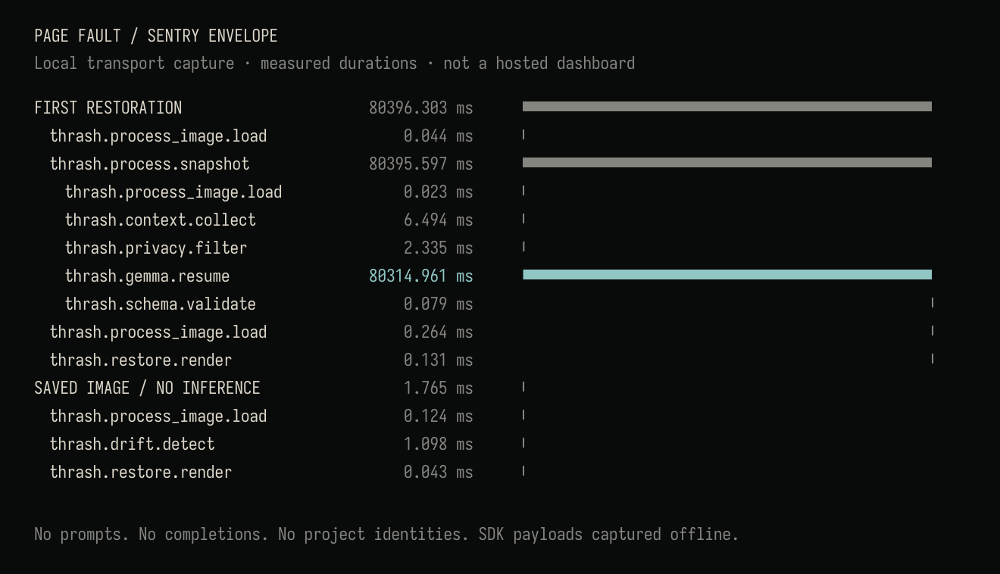

# Sentry: observability without project contents

**Implementation and local SDK envelope capture are verified. Hosted verification was not performed: no DSN/project access was available at the release gate. This does not block release.** Nothing in the media folder is presented as proof of backend receipt. No telemetry was uploaded during this phase.

THRASH traces my friend's context switches. Sentry traces THRASH's.

## What is instrumented

`Kernel.restore` owns `thrash.page_fault`, with Sentry's `gen_ai.invoke_agent` operation. Real nested work becomes child spans: image loading, snapshot/context collection, final prompt privacy filtering, `thrash.gemma.resume` (`gen_ai.request`), schema validation, drift detection and canonical resume-report construction (`thrash.restore.render`). The latter measures building the canonical report, **not painting the Textual screen**.

Spans reflect work actually performed. A fresh image needs inference but has no historical baseline to compare, so it skips drift detection. An existing image runs drift detection and report construction but makes **no model call**. We do not add empty stages merely to produce an ideal-looking trace. The outgoing project's snapshot during a switch is a separate operation; the primary PAGE FAULT trace concerns restoring the destination.

The model span records Ollama's actual input/output token counts and load/prompt-evaluation/generation durations when returned, HTTP inference time, and repair-attempt count. Schema spans record validity and completed/decision/unresolved counts. Root restoration records failure/fallback and snapshot age. Unknown model identifiers are omitted unless in the fixed public-model allowlist. There are no invented token estimates or prices.

## Opt in

```sh
pip install -e ".[sentry]"
# Configure SENTRY_DSN privately in the invoking environment, never in Git.
THRASH_SENTRY=1 thrash switch game-alpha
```

Both `THRASH_SENTRY=1` and a nonempty `SENTRY_DSN` are required. Without either, the SDK is never initialized. Missing optional SDK, malformed DSN and transport failure all preserve kernel behavior. An explicit bounded flush runs at exit; ordinary kernel operations do not wait for delivery. Delivery remains best-effort and can fail silently by design.

To send **only the synthetic evaluation** after configuring access:

```sh
THRASH_SENTRY=1 python scripts/eval/run.py --output /tmp/thrash-eval-public.json --upload
```

The evaluation's default transport is a local recorder, even when a DSN exists. `--upload` additionally forwards only sanitized SDK envelopes to the opt-in Sentry client. The output JSON contains synthetic model outputs and is never uploaded as an attachment. Verify receipt in Sentry; a successful client call alone is not proof of ingestion.

## Privacy boundary

- The integration never receives raw function arguments or return objects as span attributes. It selects typed counts, booleans, fixed operation names, fixed model names and fixed categories.
- The outgoing transaction is rebuilt from an allowlist both before SDK capture and at `before_send_transaction`. Unknown attributes are dropped, not regex-redacted. Generated trace/span IDs are random; no project identity or alias is sent, even for demos.
- The SDK has no default or automatic integrations. No HTTP/model auto-instrumentation, logs, errors, stack frames, sessions, profiling, client reports, breadcrumbs, environment dump or attachments are enabled.
- Each capture uses a private SDK Scope. Host name, user, request, tags, environment/release context, extra fields and SDK-added contexts are removed from the event. The configured DSN is used solely for routing/authentication, never committed.
- Error events are discarded; exception messages never become telemetry. Failures are booleans. A broken tracing client cannot replace a business exception or fail restoration.
- Ollama remains loopback-only with environment proxies disabled. Optional Sentry transport is the sole deliberate external telemetry path.

Source code, notes, README text, Git diffs/subjects, prompts, completions, absolute paths, home directories, names, aliases, TODOs, IRQ text, credentials and identity are **not telemetry fields**. SDK upgrades should rerun the transport-level privacy tests before widening the supported range.

## Real debugging finding

In the preserved Prompt 4 before-run, the first measured restoration took 80.397 s. The `thrash.gemma.resume` span accounted for 80.315 s, over 99.8% of that duration. Ollama reported:

| First call component | Measured duration |
|---|---:|
| Model loading | 43.116 s |
| Prompt evaluation | 29.979 s |
| Token generation | 7.203 s |
| Whole model HTTP call | 80.315 s |

This local trace ruled out context gathering and rendering as the source of the long wait. It also prevented a misleading conclusion that every return requires eighty seconds: the next seven fresh inferences were 5.328–6.467 s, while the median saved-image restoration was 1.982 ms and had no Gemma span. These are observations on this machine, not latency guarantees. The first call was against a newly started isolated server; the large prompt-evaluation cost cannot be attributed further from this evidence alone.

In that before-run, the schema span exposed a second useful finding: `schema_valid=true` coexisted with `decision_count=0` in every scenario. Comparing those counts with the synthetic ground truth revealed the decision-extraction failure documented in [Gemma evaluation](gemma-eval.md). A valid schema is not a complete memory. No bug or retry was fabricated; both original eight-scenario runs were schema-valid without repair. The release investigation subsequently improved decision extraction; see the before/after evaluation.

## Actual pipeline timings

The exact trace data is in [Prompt 4 before-run](eval/prompt4-results.json). Nested durations overlap; **do not add parent snapshot time to its children**. The main first-call stages are listed below; the final values are reproduced from the captured envelopes.

| Stage | Fresh image, ms | Saved image, ms |
|---|---:|---:|
| `thrash.process_image.load` | 0.331 | 0.124 |
| `thrash.context.collect` | 6.494 | not executed |
| `thrash.privacy.filter` | 2.335 | not executed |
| `thrash.gemma.resume` | 80314.961 | not executed |
| `thrash.schema.validate` | 0.079 | not executed |
| `thrash.drift.detect` | not executed | 1.098 |
| `thrash.restore.render` | 0.131 | 0.043 |

Image-load times aggregate repeated actual reads in that operation. The fresh path also includes model readiness checking, JSON serialization and disk writes, so the named child durations need not equal the parent wall time.

## Screenshot status and reproducibility



`08-sentry-trace.png` is a **locally rendered waterfall of real SDK envelopes**, explicitly labeled as a local transport capture. It is not a screenshot of Sentry's website. Regenerate with:

```sh
python scripts/capture/trace.py
```

The strongest hosted trace to capture after access is available is the first fresh PAGE FAULT, expanded to show Gemma's load/prompt/generation metrics, beside a cached PAGE FAULT with no inference. Hide account names, project identifiers, URLs and any unrelated traces in the dashboard capture. Show the schema-valid/zero-decisions span next to the evaluation findings rather than claiming that validity means semantic success.

## Offline verification

With the flag unset or `THRASH_SENTRY=0`, tests make SDK initialization and socket connection attempts fail if invoked. Deterministic restore still succeeds, and the mocked model client only accepts a loopback URL. Two actual eight-scenario Gemma runs additionally executed with only the loopback interface available, read-only weights and a fresh isolated Ollama home. They required no cloud request. The Sentry transport was a recorder; no Sentry server was contacted.

These checks supplement the earlier [foundation offline test](foundation-verification.md). The full test suite uses mock model replies and a mock Sentry transport and needs no network or Gemma server. Install `[dev,sentry]` to include SDK transport tests; without the optional SDK that test module skips.

## Sources and scope

Implementation follows Sentry's official [Python SDK API](https://getsentry.github.io/sentry-python/api.html) for isolated clients and before-send filtering, and its [GenAI span conventions](https://getsentry.github.io/sentry-conventions/attributes/gen_ai/) for agent/model spans. Metrics come from the official [Ollama chat response](https://docs.ollama.com/api/chat). SDK version verified: 2.71.0. Actual Agent Tracing dashboard recognition remains unverified until hosted ingestion can be inspected.
